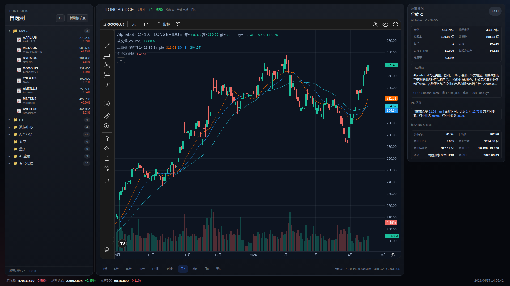

# Stock Platform

一个开源的股票行情看板平台：TradingView 专业图表 + 多数据源聚合 + 自建 Portfolio 组合管理 + 公司基本面缓存。



- **后端**：Flask + SQLAlchemy，提供 TradingView UDF 兼容的行情接口、Portfolio 组合（文件夹/股票/Markdown 笔记三位一体）、证券静态信息及基本面缓存。
- **前端**：Vite + React 19 + TradingView Charting Library，暗色主题的交易终端 UI。
- **数据源**：Longbridge (OpenAPI) / Binance / FMP / Polygon / Finnhub / AllTick。

## 功能亮点

- TradingView 风格专业图表（K 线 / 均线 / 自定义指标）
- Portfolio 树形自选管理，支持文件夹、股票、Markdown 笔记三种节点，拖拽排序
- 公司基本面数据（简介、CEO、市值、PE、机构评级、预测 EPS、派息等）
- 静态信息 / 基本面本地缓存 + 批量刷新脚本
- 多数据源按优先级自动回退

## 项目结构

```
stock-platform/
├── api/                  # Flask 后端
│   ├── app.py            # 应用入口 + 路由
│   ├── models.py         # SQLAlchemy 模型
│   ├── symbol_registry.py# 证券元数据 / 基本面缓存
│   ├── providers/        # 各数据源实现
│   ├── clients/          # 第三方 API 客户端
│   ├── scripts/          # 运维脚本（迁移、批量刷新等）
│   ├── instance/udf.db   # SQLite 数据库（已入库，含演示数据）
│   └── .env.example      # 环境变量模板
├── frontend/             # React 前端
│   ├── src/App.jsx       # 主界面
│   ├── src/components/   # TradingChart / PortfolioSidebar 等
│   └── public/charting_library/  # TradingView 图表库（需自行下载，见下）
└── docs/                 # 接口文档 & 自定义指标说明
```

## 快速开始

### 0. 前置依赖

- Python ≥ 3.10
- Node.js ≥ 18
- Git

### 1. 克隆代码

```bash
git clone https://github.com/haskaomni/ai-chain-dashboard.git
cd ai-chain-dashboard
```

### 2. 启动后端

```bash
cd api

# 建议使用虚拟环境
python3 -m venv .venv
source .venv/bin/activate

pip install -r requirements.txt

# 配置环境变量：复制模板后按需填写你的 API Key
cp .env.example .env

# 数据库 udf.db 已随仓库附带；如需自行迁移/初始化：
python scripts/migrate_symbol_static_info.py
python scripts/migrate_watchlist_to_portfolio.py

# 启动服务（默认 http://127.0.0.1:5200）
python app.py
```

### 3. 启动前端

```bash
cd frontend

# ⚠️ TradingView Charting Library 因版权问题不在仓库中，
# 请自行向 TradingView 申请并将解压后的 charting_library/ 目录
# 放到 frontend/public/charting_library/
# 申请地址：https://www.tradingview.com/charting-library/

npm install
npm run dev
```

打开浏览器访问 `http://localhost:5173`（默认 Vite 端口）。

### 4. 首次使用建议

```bash
# 预热 portfolio 内所有公司的静态信息 + 基本面（跳过已缓存的）
cd api
.venv/bin/python scripts/refresh_symbol_static_info.py

# 补齐并发刷新遗漏的基本面
.venv/bin/python scripts/refill_missing_fundamentals.py
```

## 环境变量

`api/.env` 主要项：

| 变量 | 说明 |
|------|------|
| `DATABASE_URL` | 默认 `sqlite:///udf.db`，可改 Postgres |
| `SECRET_KEY` | Flask session 密钥 |
| `PORT` | 后端监听端口，默认 `5200` |
| `LONGPORT_APP_KEY` / `LONGPORT_APP_SECRET` / `LONGPORT_ACCESS_TOKEN` | [Longbridge OpenAPI](https://open.longportapp.com/) 凭证，港美股行情 + 基本面主要来源 |
| `BINANCE_API_KEY` / `BINANCE_API_SECRET` | 加密货币行情（可选） |
| `POLYGON_API_KEY` / `FMP_API_KEY` / `FINNHUB_API_KEY` | 其他综合数据源（可选） |

`frontend/.env.local`：

```bash
VITE_UDF_BASE_URL=http://127.0.0.1:5200  # 后端地址
# VITE_API_BASE_URL=...                  # Portfolio API 地址，默认同 UDF
```

## 常用脚本

全部位于 `api/scripts/`：

| 脚本 | 用途 |
|------|------|
| `import_longbridge_symbols.py` | 批量导入 Longbridge 证券到本地 symbol 表 |
| `refresh_symbol_static_info.py` | 刷新 portfolio 中 / 全部 symbol 的静态信息 + 基本面缓存 |
| `refill_missing_fundamentals.py` | 扫描并补齐 fundamentals 为空的 portfolio symbol |
| `migrate_symbol_static_info.py` | 为 symbol 表添加 static_info JSON 列 |
| `migrate_watchlist_to_portfolio.py` | 旧 watchlist → 新 portfolio 结构迁移 |

建议把以下任务加到 crontab（凌晨运行）：

```cron
0 3 * * * cd /path/to/stock-platform/api && .venv/bin/python scripts/refresh_symbol_static_info.py >> logs/refresh.log 2>&1
30 3 * * * cd /path/to/stock-platform/api && .venv/bin/python scripts/refill_missing_fundamentals.py >> logs/refill.log 2>&1
```

## 主要接口

| 路径 | 说明 |
|------|------|
| `/api/udf/config` / `/api/udf/history` / `/api/udf/symbols` / `/api/udf/search` | TradingView UDF 协议 |
| `/api/v1/symbols/{symbol}/static-info` | 证券静态信息 + 基本面（24h 缓存） |
| `/api/v1/portfolios/tree` | 组合树 |
| `/api/v1/portfolios/nodes` | 节点 CRUD（文件夹 / 股票 / Markdown 笔记） |

完整接口见 [docs/api.md](docs/api.md)。

## 开发 / 运维提示

- 后端日志：`api/logs/app.log` + `api/logs/error.log`
- 前端构建：`cd frontend && npm run build`（产物在 `frontend/dist/`）
- 前端 lint：`npm run lint`
- 数据库文件 `api/instance/udf.db` 已入库（SQLite），方便开箱即用；也可在 `.env` 中切换到 PostgreSQL

## 文档

- [API 接口文档](docs/api.md)
- [UDF 协议说明](docs/udf.md)
- [自定义指标开发指引](docs/custom-indicators.md)

## 致谢

- [TradingView Charting Library](https://www.tradingview.com/charting-library/)
- [Longbridge OpenAPI](https://open.longportapp.com/)
- [Lightweight Charts](https://github.com/tradingview/lightweight-charts)

## License

MIT
